# 机器学习八股文

## Machine Leaning

### ML 基础概念

1. Overfitting / Underfitting  

   **过拟合**指模型与数据的匹配程度过高，将训练数据一些正常的起伏、波动、异常值也当作是数据的特征，导致模型对新数据的泛化能力变差。具体的表现为在训练集上表现非常优秀，而在验证集/测试集中表现非常差。
    - 解决过拟合的方法一般有：1) 适量减少特征的数量；2) 添加**正则化项**(Regularization)。正则化，顾名思义，目的是为了降低特征对于预测结果的影响能力。常见的正则化项有L1正则项和L2正则项。详见正则化。
    
    **欠拟合**与过拟合相反，指的是模型缺乏足够的泛化能力。
    - 解决欠拟合的方法有：1) 增加训练轮数；2) 增加模型特征；3) 减少正则项。

2. Bias / Variance trade-off

    偏差(Bias)指模型预测结果与真实值的差异程度，描述了模型的拟合能力；方差(Varience)指模型面对不同数据集时的差异程度，描述了数据扰动对模型的影响。
    一般来说，越简单模型的偏差越高，方差越低；越复杂模型的偏差越低，方差越高。这同样也对应着模型的过拟合与欠拟合。

    权衡偏差与方差的常见方法有**交叉认证**(Cross-Validation)。K折交叉验证的基本方法为：将训练集平均分为$k$份，每次训练取其中一份作为验证集，剩下$k-1$份作为训练集，重复$k$次，直到每一份小数据集都被作为过验证集。最终的损失为$k$次训练的损失取平均。

### 正则化 Regularization

1. L1 vs L2

    - L1正则化，又称LASSO、L1范数，是所有参数的绝对值之和。
        $$
            \lVert x \lVert_1=\sum_{i=1}^m\lvert x_i \lvert
        $$
    
    - L2正则化，又称Ridge，岭回归，是所有参数的平方和的平方根。

        $$
            \lVert x \lVert_2=\sqrt{\sum_{i=1}^m x_i^2}
        $$

    - 两种范数都有助于降低过拟合风险。L1范数可以用于**特征选择**，但不能直接求导，因此不能使用常规的梯度下降法/牛顿法等进行优化（常见方法有坐标轴下降法和 Lasso 回归法）；L2范数方便求导。

2. L1范数的稀疏性 / 为何L1正则化可以用于特征选择？

    L1范数相比于L2范数，更容易得到**稀疏解**，即L1范数可以将不重要的特征参数优化至**0**.

    - 如何理解？
    > 假设损失函数 $L$ 与某个参数 $x$ 的关系如下图所示：此时最优点位于绿色点处，$x<0$.
    > 
    > 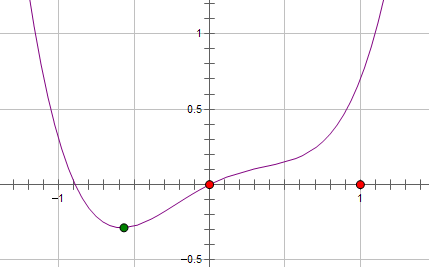
    >
    > 这时施加 L2 正则化，新的损失函数 $(L+Cx^2)$ 如下图蓝线所示，可以看到最优的 $x$ 在黄点处，$x$ 的绝对值减小了，但依然非零。
    >
    > 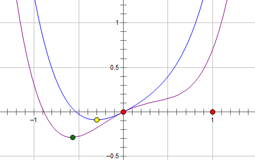
    >
    > 而如果施加 L1 正则化，则新的损失函数 $(L+C\lvert x \lvert)$ 如下图粉线所示，最优的 $x$ 就变成了 0。
    >
    > 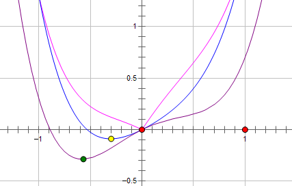
    >
    > 略加推导可以得到，当施加 L2 正则化时，当且仅当损失函数原本的导数为 0 时，损失函数才会在 $x=0$ 处极小；而施加 L1 正则化时，参数 $C$ 与损失函数的导数仅需满足 $C>\lvert L \lvert$ 的关系，$x=0$ 便会成为损失函数的一个极小值点。 
    >
    > 上面只分析了一个参数 $x$。事实上 L1 正则化会使得许多参数的最优值变成 0，使得模型变得稀疏。利用这样的特性，我们便可以使用L1正则化来帮助筛选特征。

### 机器学习中的评估指标 Metrics

1. Precision / Recall / $F_1$ Score

    对于二分类问题，我们常常使用精确率(Precision)、召回率(Recall)以及$F_1$ Score来评估二分类模型的性能。对于一个二分类器，在数据集上的预测情况可以分为以下4种：

    - TP(True Positive)，将正类**正确**预测为正类；
    - TN(True Negative)，将负类**正确**预测为负类；
    - FP(False Positive)，将负类**错误**预测为正类；
    - FN(False Negative)，将正类**错误**预测为负类；
    
    有了以上概念，我们可以给出以下评估指标的定义：

    - 精确率定义为：
        $$
            P=\frac{TP}{TP+FP}
        $$
        即在模型**预测为正类**的样本中，预测正确的比例。可以看到，精确率更加关注于模型认为是正类样本的结果。
    - 召回率定义为：
        $$
            R=\frac{TP}{TP+FN}
        $$
        即在正类的样本中，模型预测正确的比例。相比之下，召回率更加关注于那些**真实值为正类**的样本。
    - 此外，$F_1$ 值定义为精确率与召回率的调和均值，即
        $$
            \frac{2}{F_1}=\frac{1}{P}+\frac{1}{R}
        $$
        $$
            F_1 = \frac{2 \times P \times R}{P + R} = \frac{2TP}{2TP+FP+FN}
        $$
        当精确率和召回率都高时，$F_1$ 值也会高。

2. 混淆矩阵 Confusion Matrix

    分类结果的混淆矩阵如下表所示。

    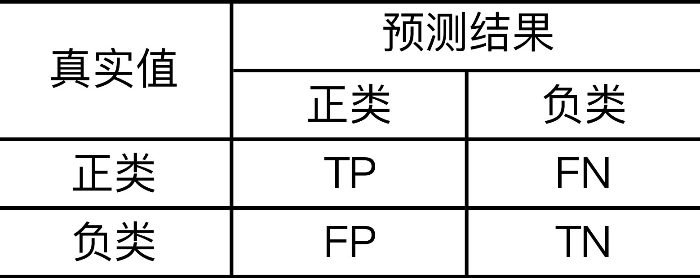

3. macro-$F_1$ vs micro-$F_1$

    很多时候我们有多个二分类混淆矩阵（例如多次训练与测试 / 多个数据集 / 多分类任务中每两两类别的组合等），这是我们希望在 $n$ 个二分类混淆矩阵上综合考察模型性能。

    - macro-$F_1$

        一种直接的做法是直接计算各个混淆矩阵的精确率和召回率，再计算平均值，分别得到 macro-$P$、macro-$R$和对应的macro-$F_1$. 
        $$
            \text{macro-}P = \frac{1}{n}\sum_{i=1}^n P_i, \qquad
            \text{macro-}R = \frac{1}{n}\sum_{i=1}^n R_i,
        $$
        $$
            \text{macro-}F_1 = \frac{2 \times \text{macro-}P \times \text{macro-}R}{\text{macro-}P + \text{macro-}R}
        $$
    
    - micro-$F_1$

        另一种做法是先将各个混淆矩阵的对应元素进行平均，得到$\overline{TP}$、$\overline{TN}$、$\overline{FP}$和$\overline{FN}$，再基于这些值计算出micro-$P$、micro-$R$和对应的micro-$F_1$. 
        $$
            \text{micro-}P = \frac{\overline{TP}}{\overline{TP}+\overline{FP}}, \qquad
            \text{micro-}R = \frac{\overline{TP}}{\overline{TP}+\overline{FN}},
        $$
        $$
            \text{micro-}F_1 = \frac{2 \times \text{micro-}P \times \text{micro-}R}{\text{micro-}P + \text{micro-}R}
        $$

4. ROC 曲线 / AUC 面积

    ROC 曲线(Receiver Operating Characteristic)与 AUC (Area Under ROC Curve)是面对**不平衡分类问题**时最常用的评估指标。要了解 ROC 是什么，首先我们根据混淆矩阵再定义两个指标：True Positive Rate(TPR) 以及 False Positive Rate(FPR). 

    $$
        TPR = R = \frac{TP}{TP+FN}, \qquad
        FPR = \frac{FP}{TN+FP},
    $$
    正常来说，一个好的模型应该满足高 TPR 和低 FPR。对于任意一个训练好的模型，在给定测试数据上我们都能计算出它的 TPR 和 FPR。以 FPR 为横坐标，TPR 为纵坐标，我们可以将任意模型的一对 (FPR, TPR) 画在该坐标图中，如下图所示。同时我们将由该坐标轴构成的空间称为 ROC 空间。图1中假设有 A、B、C、D、E 共计五个模型。在 ROC 空间中，模型越靠近左上角，表明模型效果越好。

    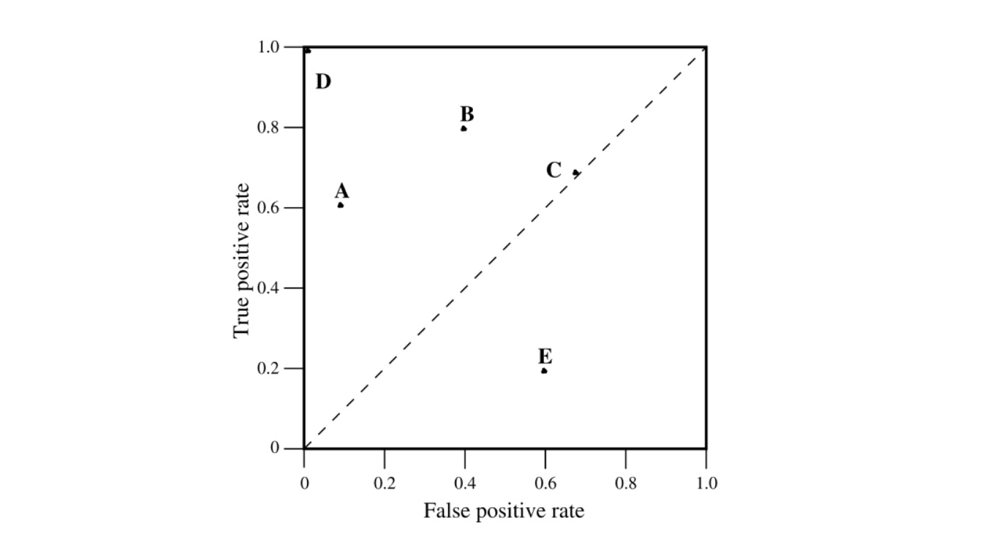

    在二分类问题的大多数情况中（尤其是神经网络中），我们判定一个样本是正类和负类的依据是设置一个阈值，超过该阈值的样本被标记为正类，反之则为负类。一般而言，这个阈值被设置为0.5。那么如果我们尝试使用不同的阈值来划分正负类，我们就能得到多组 (FPR, TPR)。我们可以根据这些坐标近似地在 ROC 空间中画出一条曲线，即 **ROC 曲线**。只要 (FPR, TPR) 点足够多，我们可以计算出曲线下的面积，即 **AUC面积**，如下图所示。

    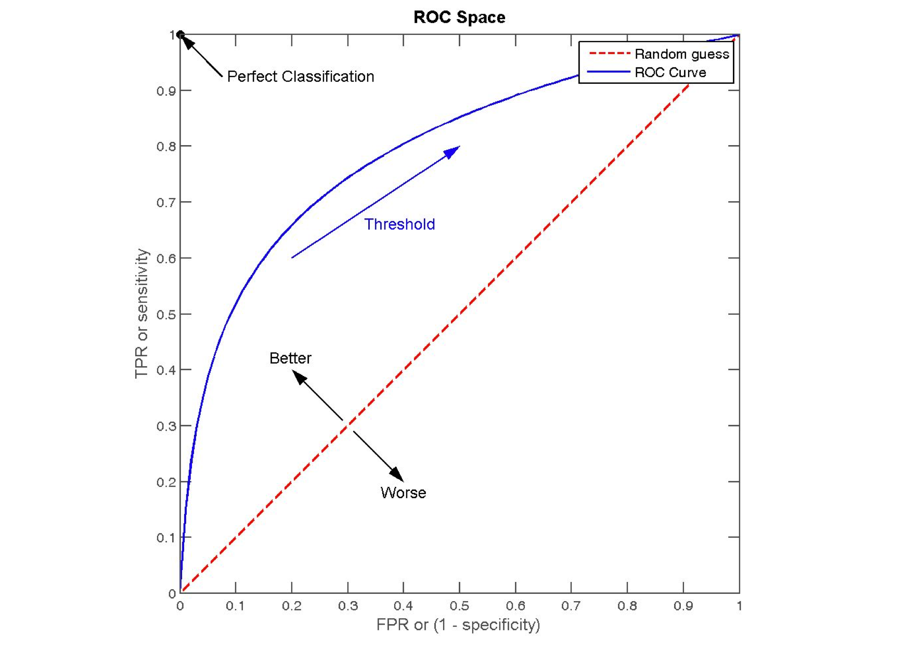

### Loss与优化

1. 凸优化问题

    对于一个优化问题，如果其目标函数是**凸函数**，且可行域是**凸集**（集合中任意两点连线上的任意点都在集合内），那么它就是一个凸优化问题。
    
    定义域 $\mathbb{D}$ 是一个凸集的函数 $f$ 是凸函数，当且仅当对于任意的 $x,y \in \mathbb{D}$ 和 $\theta \in [0,1]$，都有：

    $$
        f(\theta x+(1-\theta)y) \le \theta f(x)+(1-\theta) f(y)
    $$

    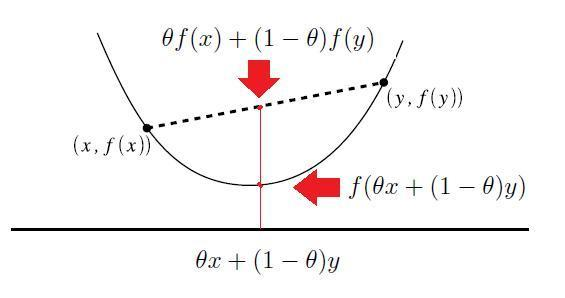

    数学中强调凸优化问题的重要性，在于凸优化问题的**局部最优解**必然也是其**全局最优解**。这个特性使得我们可以使用贪心算法、梯度下降法、牛顿法等方法来求解凸优化问题。事实上，我们求解许多非凸优化问题，也是通过将其拆解为若干个凸优化问题，再分别进行求解。

2. MSE / MSELoss

    均方误差 (Mean Square Error, MSE)，是回归任务中最常见的度量指标。

    $$
        E(f;D)=\sum_{i=1}^m (f(x_i) - y_i)^2
    $$

3. 以 MSELoss 为损失函数的逻辑回归是凸优化问题吗？

    **不是**。逻辑回归将线性模型通过 sigmoid 非线性函数映射为分类问题，其 MSE 是一个非凸函数，优化时可能得到局部最优解而得不到全局最优解，所以以 MSELoss 为损失函数的逻辑回归不是凸优化问题。

4. 线性回归，最小二乘法与最大似然估计的关系？

    求解线性回归常用的方法有**最小二乘法 (OLS)**和**最大似然估计 (MLE)**。

    - 最小二乘法以预测值和真实值的平方和作为损失函数 (MSELoss)。

        $$
            J(w)=\sum_{i=1}^m (h_w(x_i) - y_i)^2
        $$

    - 最大似然估计在已知 $x$ 与 $y$ 的情况下，以**概率最大**的角度，估计模型可能性最大的参数 $h_w$。设误差 $\epsilon_i = y_i - h_w(x_i)$， 由于 $\epsilon_i$ 符合高斯分布，可得概率密度函数：
        
        $$
            p(\epsilon_i) = \frac{1}{\sigma \sqrt{2\pi}} e^{-\frac{(\epsilon_i)^2}{2\sigma^2}}
        $$

        将 $\epsilon_i = y_i - h_w(x_i)$ 代入，可得：

        $$
            p(y_i | h_w(x_i)) = \frac{1}{\sigma \sqrt{2\pi}} e^{-\frac{(y_i - h_w(x_i))^2}{2\sigma^2}}
        $$

        则似然函数公式如下：

        $$
            \begin{aligned}
                L(h_w(x_i)) &= \prod_{i=1}^m p(y_i | h_w(x_i))\\
                &= \prod_{i=1}^m \frac{1}{\sigma \sqrt{2\pi}} e^{-\frac{(y_i - h_w(x_i))^2}{2\sigma^2}} \\
            \end{aligned}
        $$

        等号两边取对数，不影响函数的极值点。

        $$
            \begin{aligned}
                \log L(h_w(x_i)) &= \sum_{i=1}^m \log \frac{1}{\sigma \sqrt{2\pi}} e^{-\frac{(y_i - h_w(x_i))^2}{2\sigma^2}}\\
                &= m \log \frac{1}{\sigma \sqrt{2\pi}} - \frac{1}{2\sigma^2} \sum_{i=1}^m (y_i - h_w(x_i))^2
            \end{aligned}
        $$

        我们知道 $h_w(x)$ 是关于权重 $w$ 的函数，不妨设为 $l(w)$。因此有：
            
        $$
            \begin{aligned}
                l(w) = m \log \frac{1}{\sigma \sqrt{2\pi}} - \frac{1}{2\sigma^2} \sum_{i=1}^m (y_i - h_w(x_i))^2
            \end{aligned}
        $$

        去除前面的常数项和常数系数，可以看到与最小二乘法的的公式一致，之后求解过程同最小二乘法。因此得出结论，最小二乘法与最大似然估计从两个不同的角度出发，得到一致的结果。

5. 相对熵与交叉熵 Ralative-Entropy / Cross-Entropy

    我们常用**信息量**来量化数据中的信息。设事件 $x_0$ 发生的概率为 $p(x_0)$，则其信息量为：

    $$
        I(x_0) = -\log p(x_0)
    $$

    **熵** (Entropy) 被用来度量一个系统的混乱程度，代表一个系统中所有事件信息量的期望。熵越大，该系统的不确定性也越大。

    $$
        H(X) = -\sum_{x \in X}p(x_i) \log p(x_i)
    $$

    **相对熵** (Ralative Entropy)，又称 **KL 散度** (Kullback-Leibler Divergence)，是两个随机分布 $p$ 与 $q$ 之间的对数差值的期望。

    $$
        D_{KL}(p||q)=\sum_{x\in X} p(x)\log\frac{p(x)}{q(x)}=-\sum_{x\in X} p(x)[\log q(x) - \log p(x)]
    $$

    **交叉熵** (Cross-Entropy)，与 KL 散度类似，是两个随机分布 $p$ 与 $q$ 之间距离的另一种度量。

    $$
        CEH(p,q)=−\sum_{x \in X}p(x)logq(x)
    $$

    > **为何在机器学习中常使用交叉熵而不是 KL 散度作为损失函数？**
    >
    > 可以看到，相对熵、交叉熵之间存在以下关系：
    > 
    >    $$
    >       D_{KL}(p||q) = CEH(p,q) - H(p)
    >    $$
    >    
    > 在机器学习中，可以将 $p$ 看作真实分布，$q$ 为预测分布。则当 $p$ 的分布已知时，$H(p)$ 为常数，交叉熵与 KL 散度等价。

### Naive Bayes 朴素贝叶斯

1. 概率相关公式及贝叶斯定理

    - 条件概率：事件 A 在另外一个事件 B 已经发生条件下的发生概率，即 $p(A|B)$；
    - 联合概率：事件 A 和事件 B 同时发生的概率，即 $p(A, B) = p(A|B) * p(B)$；
    - 全概率：若事件 B1, B2, ..., Bn 构成一个**完备事件组**，即他们两两不相容，且和为全集，则对于任意事件 A 有： $p(A)=\sum^n_{i=1} [p(A|B_i)*p(B_i)]$
    - 贝叶斯概率：在日常生活中，有时候我们难以直接求出 $p(A_i|B)$，但我们若已知 $p(B|A_i)$，$p(A_i)$ 和 $p(B)$，则有：
        $$
            p(A_i|B) = \frac{p(B|A_i)*p(A_i)}{p(B)} = \frac{p(B|A_i)*p(A_i)}{\sum^n_{j=1}p(B|A_j)*p(A_j)}
        $$
        其中，$p(A_i|B)$ 被称为**后验概率**，$p(A_i)$ 被称为**先验概率**。

2. 朴素贝叶斯分类器

    - 设 $x=\{a_1,a_2,...,a_m\}$ 为一个待分类项，其中 $a_i$ 是 $x$ 的特征属性。
    - 有类别集合 $C=\{y_1,y_2,...,y_n\}$。
    - 对每一个类别 $y_i$，统计各个特征属性的条件概率，即 $p(a_1|y_1)$, $p(a_2|y_1)$, ..., $p(a_m|y_1)$。
    - 根据贝叶斯公式，求得 $p(y_i|x)=\frac{p(x|y_i)*p(y_i)}{p(x)}$。
    - 计算所有类别的 $p(y_i|x)$，概率最大的 $y_k$ 即为预测的类别。
    - 该分类器之所以被称为“朴素”贝叶斯，是因为模型假设待分类项 $x$ 的所有特征都是**独立的**事件。
    - 常见的朴素贝叶斯分类器有：
        - GaussianNB，该分类器用**高斯分布**来假设类别的先验概率分布，一般用于连续型数据。
        - MultinomialNB，该分类器用**多项式分布**来假设类别的先验概率分布，用于多项式数据。
        - BernoulliNB，该分类器用**伯努利分布**来假设类别的先验概率分布，用于二项分布数据。

3. 朴素贝叶斯分类器的优缺点

    朴素贝叶斯分类器的主要优点有：
    - 模型发源于古典数学概论，算法比较简单，且有稳定的分类效率；
    - 对小规模的数据表现好，适合多分类任务；
    - 对缺失数据不敏感，例如文本分类等任务；
    - 不存在过拟合的说法。

    朴素贝叶斯分类器的缺点有：
    - 朴素贝叶斯假设特征之间相互独立，但在现实中这个假设往往不成立；
    - 朴素贝叶斯需要先估计先验概率，如果估计不准确容易影响分类结果；
    - 基于概率的分类有可能会不准确。

4. Generative Model vs Discriminative Model 生成模型 / 判别模型

    生成模型通过学习联合概率 $P(X,Y)$，即特征 $x$ 与类别 $y$ 同时出现的概率，再对每一个类别求条件概率，取概率最大的类别作为预测结果，即 $P(Y|X) = \frac{P(X,Y)}{P(X)}$。
     - 生成模型能学习到更多信息，如每个特征的边缘分布 $p(x)$；
     - 生成模型收敛速度快，且对小规模数据或稀疏数据表现较好；
     - 生成模型不容易出现过拟合现象；
     - 生成模型的效果一般没有判别模型好。
    
    判别模型则是通过学习条件概率，即直接预测特征 $x$ 下类别 $y$ 的概率。
     - 判别模型的分类边界更加灵活，能够拟合更加复杂的边界；
     - 只用学习分类的信息，问题得到简化；
     - 准确率普遍较生成模型较高。

### 支持向量机 Support Vector Machine, SVM

1. SVM 的核心思想？

    SVM 是定义在特征空间中的线性分类器，目标是使得分隔超平面两边的数据点离超平面的**间隔最大**。当数据线性可分时，可以通过**硬间隔最大化**来学习一个线性的超平面；当数据近似线性可分时，则可以通过加上一个松弛变量，通过**软间隔最大化**来学习超平面；当线性不可分时，也可以使用核函数，将输入空间映射到高维的特征空间。

2. 硬间隔最大化

    首先定义超平面 $(w,b)$ 关于样本点 $(x_i,y_i)$ 的**函数间隔**为 $\hat{\gamma}_i=y_i(wx_i+b)$ 但是，如果成比例地改变 $w$ 和 $b$ 的值，函数间隔会发生改变，但其超平面并没有变。为了解决这个问题，引入**几何间隔**为超平面与样本点的直线距离 $\gamma_i=y_i(\frac{w}{||w||}x_i+\frac{b}{||w||})$。硬间隔最大化的优化目标就是找到合适的超平面 $(w,b)$，使得点到超平面的间隔最大，即：
    $$
        \max_{w,b} \gamma, \text{s.t.,} y_i(\frac{w}{||w||}x_i+\frac{b}{||w||}) \geq \gamma, i=1,2,...,N
    $$
    我们可以将这个优化问题转化为：
    $$
        \min_{w,b} \frac{1}{2}||w||^2, \text{s.t.,} y_i(wx_i+b)-1 \geq 0,i=1,2,...,N
    $$
    可以使用拉格朗日乘子将该问题转换为对偶问题，这样可以便于求解：
    $$
        \min_\alpha \frac{1}{2}\sum_i^N \sum_j^N \alpha_i \alpha_j y_iy_j(x_i\cdot x_j)-\sum_i^N \alpha_i, \text{s.t.,} \sum_i^N \alpha_i y_i=0, \alpha_i \geq 0,i=1,2,...,N
    $$
    转换为对偶问题还可以便于引入**核技巧**来解决非线性问题，即将内积 $(x_i\cdot x_j)$ 用核函数 $K(x_i,x_j)=\phi(x_i)\cdot\phi(x_j)$ 来代替。

3. 软间隔最大化

    在现实中数据并不可能总是线性可分（可能存在噪音点、离群点等脏数据），线性不可分意味着有些样本点 $(x_i,y_i)$ 不能满足函数间隔大于 1 的约束条件。为了使得模型更加鲁棒，我们需要将硬间隔转换为软间隔。对于每一个样本点，我们引进一个松弛变量 $\xi_i$，使得函数间隔加上松弛变量大于 1，即 $y_i(wx_i+b)\geq1-\xi_i$。

    同时，添加一个惩罚参数 $C$，目标函数变为 $\frac{1}{2}||w||^2 + C\sum_i^N \xi_i$。惩罚参数的添加是使得**函数间隔尽可能大，而误分类点尽可能少**，惩罚参数是调和二者的系数。当 $\xi_i = 0$ 时，样本点在间隔之外；当 $0 <\xi_i < 1$ 时，分类正确，样本点在超平面与间隔边界之间；当 $\xi_i > 1$ 时，样本点被误分。

4. Hinge Loss 合页损失函数

    Hinge Loss 的图像如图所示，横轴是函数间隔 $\hat{\gamma}_i=y_i(wx_i+b)$，当间隔 $\hat{\gamma}_i\geq 1$ 时，表示正确分类，损失值为 0；当间隔 $\hat{\gamma}_i < 0$ 时分类错误；当间隔 $0 < \hat{\gamma}_i < 1$ 时，分类正确，但样本点在间隔边界与超平面之间。Hinge Loss 对这样的样本点也会进行惩罚，提高了样本点的利用率，这使得 SVM 对训练样本数的依赖大大减少。

    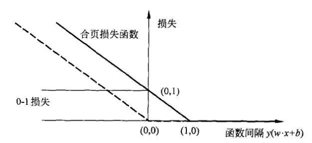

### 逻辑回归 Logistic Regression, LR

1. 逻辑回归的核心思想？

    逻辑回归主要用于分类问题，对于所给数据集，认为可以用一条直线将数据线性分类。逻辑回归与线性回归的最主要区别在于逻辑回归主要关注于分类概率与输入向量的关系，即 $P(Y=1)$ 与 $x$ 的直接关系，然后通过概率值来判断是否属于某一类别。

    逻辑回归主要考虑二分类问题。给定数据集：

    $$
        D=(x_1,y_1), (x_2,y_2),...,(x_N,y_N), x_i\in R^n
    $$

    由于 $w^T x+b$取值连续，因此可以用它来拟合条件概率 $p(Y=1|x)$. 最理想的函数其实是：

    $$
        p(Y=1|x)=
        \begin{cases}
            0, & z < 0\\
            0.5, & z = 0 \\
            1, & z > 0
        \end{cases}
        , z = w^T x + b
    $$

    但是，这个函数不可微，因此，我们使用 sigmoid 函数来拟合概率：

    $$
        y=\frac{1}{1+e^z}, z=w^T x + b
    $$

    将 $y$ 视为类后验概率估计，则重写公式有：

    $$
        P(Y=1|x)=\frac{1}{1+e^z}, z=w^T x + b,\\
    $$
    
    $$
        z = \ln\frac{P(Y=1|x)}{1-P(Y=1|x)}
    $$

    因此，逻辑回归实际上是**使用线性回归模型的预测值来逼近分类任务的对数几率**，其优点有：

    - 不仅能够预测出类别，还能预测出属于该类别的概率，对于一些需要预测概率的任务很适用；
    - 对数几率函数在任意阶都是**连续可导的凸函数**，因此可以使用许多优化算法求解。
  
2. 逻辑回归的损失函数与梯度

    设：$P(Y=1|x) = p(x), P(Y=0|x) = 1 - p(x)$，则似然函数可以写为：

    $$L(w) = \prod[p(x_i)]^{y_i}[1-p(x_i)]^{1-y_i}$$
    
    为了方便求解，一般取对数似然函数：
    
    $$
    \begin{aligned}
        l(w) = \ln L(w) & = \sum[y_i\ln p(x_i) + (1-y_i)\ln (1-p(x_i))] \\
        & = \sum[y_i\ln\frac{p(x_i)}{1-p(x_i)} + \ln(1-p(x_i))] \\
        & = \sum[y_i z_i - \ln(1 + e^{z_i})]
    \end{aligned}
    $$

    使用梯度下降法求解时，取似然函数的**相反值**进行优化，求其梯度为：

    $$    
    \begin{aligned}
        \frac{\partial J(w)}{\partial w_j} & = -\sum_i \frac{\partial [y_i z_i - \ln(1 + e^{z_i})]}{\partial z_i} \cdot \frac{\partial z_i}{\partial w_j} \\
        & = -\sum_i (y_i - p(x_i)) \cdot x_j
    \end{aligned}
    $$

    权重更新为：
    
    $$w_j := w_j + \eta(\sum_i (y_i - p(x_i)) \cdot x_j),\text{ for }i\text{ in range}(n)$$

3. 与 SVM 的区别？

    - 同样是更加关注于分类边界附近的数据点，不同之处在于，LR 通过非线性映射减小离分类平面远的数据点的权重，提升离分类平面近的数据点的权重；而 SVM 则是完全只关注于分类错误的点以及靠近分类平面的数据点，而不关注那些离分类平面较远的普通样本。
    - LR 是参数模型，而 SVM 是非参数模型。参数模型的前提是假设数据符合某种分布（如 LR 假设数据服从伯努利分布），该分布由一些参数决定。依赖数据分布会使得 LR 模型在样本不均衡时影响分类效果；而非参数模型不直接依赖于分布。
    - LR 能够产生概率，而 SVM 不能直接产生概率。

## Deep Learning

### DL 基础概念

1. 为什么神经网络需要偏置项？

    对于神经网络中的每一个神经元，都有 $y_i = W^TX_i + b$。这个式子本质上就是要用这个函数在空间中划分决策面。而如果没有偏置项，那么划分的超平面就只能经过原点。偏置项的加入使得神经网络的拟合更加灵活，如果没有偏置项，训练可能难以收敛或出现其他 bug。

    > **在所有场合都可以使用偏置项吗？**
    > 
    > 不是。例如在卷积层之后，如果要添加 Batch Normalization 层，最好不添加偏置项，因为不起作用，且会占用显卡内存。
    > 
    > 在 BN 中，有一步关键操作为：
    > 
    > $$
    >       \hat{x_i} = \frac{x_i - \mu_\mathcal{B}}{\sqrt{\sigma^2_{\mathcal{B}} + \epsilon}}
    > $$
    > 
    > 其中，$\mu_\mathcal{B}$ 为均值，$\sigma^2_{\mathcal{B}}$ 为方差。在该操作中，偏置项在计算中会被抵消掉，故偏置项不起作用。

2. Back Propagation

    BP 神经网络是由一个输入层、一个输出层和若干个隐藏层构成的。输入信号从输入层进入，经过隐藏层计算，并由输出层输出。将输出的结果和真实值进行比对得到训练的误差。该误差沿着输出层，经过隐藏层，最终传播到输入层的权值参数。由于误差传播方向和训练方向相反，故称“反向传播”。

    反向传播是为了解决神经网络无法直接应用梯度下降法的问题。由于梯度下降法只能用于“能够通过得到误差”的情况，例如逻辑回归。但隐藏层并不存在所谓“误差”，因此只能通过先将误差反向传播到隐藏层，应用链式法则得到求导函数，再使用梯度下降法进行优化。反向传播算法可以看作是梯度下降法在链式法则（Chain Rule）中的应用。

3. 梯度消失和梯度爆炸问题

    在反向传播的梯度更新中，若更新的梯度一直小于 0，就可能触发连乘效应，在之后的传播中越传越小，导致靠近输入层的权值几乎不更新，训练收敛速度变慢，这便是**梯度消失**。与之相反，若梯度过大则会触发**梯度爆炸**，以致于溢出，出现梯度为 NaN 的问题。
    
    > 当激活函数为 Sigmoid 时，容易触发梯度消失问题。因为 Sigmoid 函数的导数最大值只有 0.25，如图所示。
    > 
    > 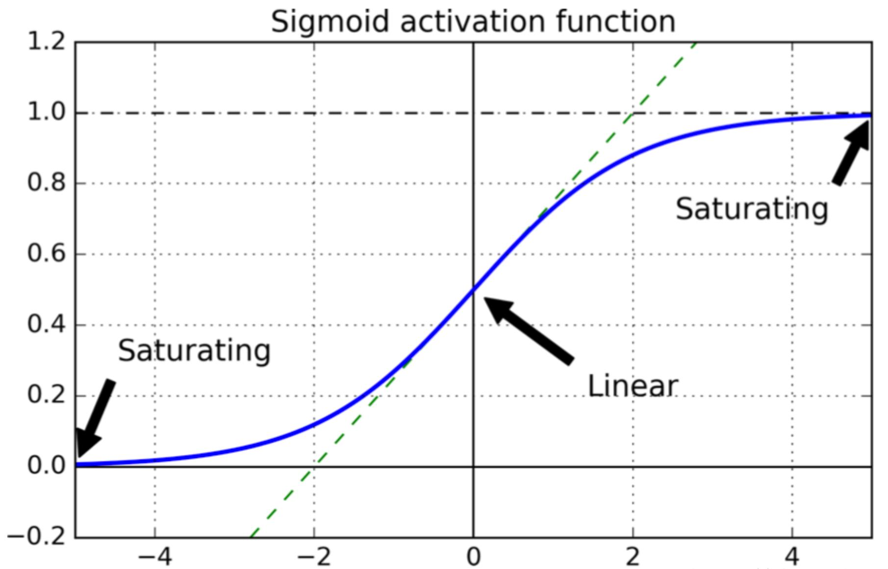

    常见的缓解梯度消失 / 梯度爆炸的方法有：
    - 使用其他**激活函数**，如ReLU等；
    - 用更合理的**权值初始化**方式，如 Xavier 初始化，He 初始化。这两种初始化方法都能保证在传播时权值的方差不变。
    - **Batch Normalization**. 梯度的更新与 $x$ 的值也有关系，因此用 BN 限制 $x$ 的分布也有利于缓解梯度消失 / 梯度爆炸问题；
    - 对权重进行**正则化**（L1、L2）；
    - 使用 **ResNet 网络**。ResNet 通过添加 Shortcut Connections，使得层与层之间可以跨层连接，减少了梯度消失 / 梯度爆炸的问题。
    - 通过**梯度截断**（Gradient Truncation）手动防止梯度爆炸。

4. 能不能将神经网络的所有权值都初始化为 0？

    不能。事实上，不能将神经网络的所有权值都设置为同一值。否则，在神经网络的更新中，两权值的更新将一模一样。多个相同的神经元相当于只有一个神经元，会使得神经网络无法拟合。

    因此，一般我们选择随机初始化，或是使用其他初始化方法，如 Xavier 初始化，He 初始化。这两种初始化方法都能保证在传播时权值的方差不变。

5. 在深度学习中缓解过拟合问题

    深度学习中防止过拟合常见的方法有：

    - 获取更多、质量更高的数据
      - 采集新的数据
      - 数据增强（图片镜像、翻转等）
      - 利用对抗网络生成数据
    - 正则化（L1、L2）
    - Dropout
    - Early Stopping
    - 集成学习，如 Bagging、Boosting 等。

6. Dropout 是什么？

    Dropout 是在每次训练过程中都随机舍弃一些神经元之间的连接。这样做可以降低对部分上层神经元的依赖关系，迫使模型去学习一些更具有鲁棒性的特征，使得模型泛化能力更强。

    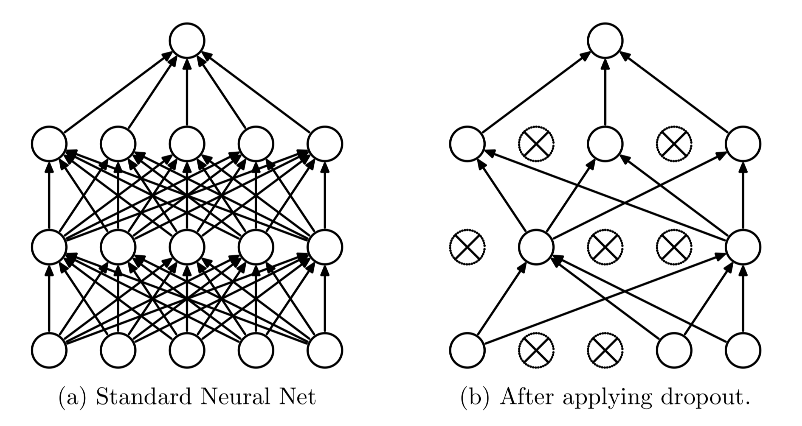
    

7. Dropout 和 Batch Normalization 在训练和预测中的区别？

    Dropout 在训练时采用，是为了减少神经元对部分上层神经元的依赖，减少过拟合的风险。而在预测中，应该用训练完成的模型，不需要 Dropout。

    对于 BN，在训练时使用每一批数据的均值和方差进行计算，对每一批数据单独进行归一化。但在测试时，可能不存在 batch 的概念（例如预测单条数据）。因此在测试时，一般使用所有训练数据的均值和方差进行计算。

    > **为什么不在训练的时候使用所有训练数据的均值和方差？**
    > 
    > 因为在训练中使用所有数据的均值和方差容易出现过拟合现象。
    > 
    > BN 的原理就是将每一批数据都归一到相同的分布。而每一批数据的均值和方差都不相同，这个差别能够增加模型的鲁棒性，在一定程度上减少模型的过拟合现象。
    > 
    > 也正是因此，当应用 BN 时，一般要求将训练集完全打乱，并用一个较大的 batch size，否则，一批数据可能无法较好得代表训练集的分布，会影响模型训练的效果。

8. 常见的 Non-Linear Activation Function 及其优缺点

    非线性激活函数是神经网络与感知机网络最大的区别，即将非线性特性引入到网络中。如果不用非线性激活函数，则每一层都是上一层的线性变换，无论网络有多少层，输出都是输入的线性组合。而加入非线性层后，神经网络便拥有了学习非线性关系的能力，这使得神经网络可以逼近任意形状的函数。

   | 函数名 |         函数表达式        |        优点           |      缺点         |
   |:-----:|:-----------------------:|:----------------------|:-----------------|
   |Sigmoid|$\displaystyle f(z)=\frac{1}{1+e^{-z}}$|1. 将输入转换为 (0, 1) 的区间。|1. 在神经网络反向传播中可能出现梯度消失问题； 2. 函数均值不为 0，使得权值总往同一方向更新， 收敛速度慢。|
   |  tanh |$\displaystyle f(z)=\frac{e^z-e^{-z}}{e^z+e^{-z}}$|1. 将输入转换为 (0, 1) 的区间； 2. 解决 Sigmoid 均值非 0 问题。|1. 依然存在梯度消失问题； 2. 幂函数计算复杂，训练时间大。|
   |  ReLU |$f(z)=max(0,x)$|1. 解决了梯度消失的问题； 2. 计算与收敛速度快。|1. 函数均值不为 0； 2. Dead ReLU Problem. 当 $x<0$ 时梯度为 0，且 该神经元之后的神经元梯度永远为 0，即神经元直接 失效。通过合理的初始化，或是降低学习率来解决。|
   |Leaky ReLU|$f(z)=max(\alpha \cdot x,x)$|1. 使得神经元在负数区域偏向于 激活而不是直接失效。|1. 函数均值不为 0； 2. $\alpha$ 的值需要确定且比较敏感（通常是一个非常小 的值，如 0.01）。

9. Gradient Descent vs Stochastic Gradient Descent vs Mini-Batch Gradient Descent

    |        方法     |                 优点           |            缺点               |
    |:--------------:|:------------------------------|:------------------------------|
    |Gradient Descent|1. 参数梯度更新方向大致确定； 2. 适合并行化计算。|1. 训练时收敛速度慢； 2. 当数据量大时，需要大量显存。|
    |Stochastic Gradient  Descent (SGD)|1. 每次只随机抽取一条数据进行梯度更新， 花费代价小； 2. 适合大量数据的训练。|1. 需要更多迭代次数； 2. 参数更新的过程震荡很大，参数更新方向有很大的波动； 3. 不适合并行化计算。|
    |Mini-Batch Gradient  Descent (MBGD)|结合了前两种方法的优势： 1. 比 GD 收敛速度快，比 SGD 更加稳定； 2. 能利用高度优化的矩阵运算，适合并行化；|1. 难以选择合适的学习率。太小的学习率会导致收敛缓慢； 太大的学习率会导致波动过大，可能跳出局部最优解。 可以采用动态调整学习率的方法（learning rate decay）。

10. 常见的优化器及其对比

    |        方法     |                 特点                                          |
    |:--------------:|:--------------------------------------------------------------|
    |GD / SGD / MBGD|1. 难以选择合适的学习率。学习率太小会导致收敛缓慢；学习率太大会导致波动过大，可能跳出局部最优解。 2. 每个参数的学习率都是相同的。如果数据是稀疏的，且不同特征的出现频率相差较大，则会出现部分特征 学习不足的问题； 3. 在训练中容易陷入鞍点，即局部最优点，在这些点的梯度为 0，无法继续训练。|
    | Momentum      |1. 借鉴了物理中的动量概念，模拟物体运动时的惯性，即更新的时候在一定程度上保留之前更新的方向，而不 是像 GD 算法一样完全按照新的梯度方向更新。这样可以增加稳定性，并且有一定的摆脱局部最优解的能力。 2. Momentum 算法会观察上一步的梯度，若当前梯度方向与历史梯度一致，则增强该方向的梯度，否则则削 弱该方向的梯度。|
    |    AdaGrad    |1. 针对 GD 算法中对于每个参数都保持同一学习率的问题，AdaGrad 算法能在训练中自动对不同参数的学习率 进行调整。对于出现频率比较低的特征，加大更新的学习率；对于出现频率高的，减小学习率。 2. 由于这个特性，AdaGrad 非常适合用于处理稀疏的数据。|
    |    RMSprop    |1. Root Mean Square prop. 对 AdaGrad 算法的改进，把 AdaGrad 的将历史梯度相加变成对历史梯度求均值； 2. 这种方法可以缓解 AdaGrad 算法学习率下降较快的问题。|
    |     Adam      |1. Adam 算法结合了 AdaGrad 和 RMSprop 的优点，即动态更新参数的学习率。不同于 RMSprop 只参考了参 数的历史平均值，Adam 同时参考了梯度的平均值和方差。 2. 在各大机器学习库中，两次估计的衰减率默认值 $\beta_1$ 和 $\beta_2$ 分别为 0.9 和 0.999.|
    |    AdamW      |1. 针对 Adam 算法中先进行梯度衰减再进行正则化，使得梯度大的参数无法正常被正则化的问题，在 AdamW 中将梯度衰减的步骤移到正则化后，解决了这一问题。

11. 如何正确使用迁移学习？

    通过使用之前在大数据集上经过训练的预训练模型，我们可以直接使用相应的结构和权重，将它们应用到我们正在面对的问题上。

    - 场景一：现有数据集***大***，数据与原数据相似度***高***

        这是最理想的情况，采用预训练模型会变得非常高效。最好的运用方式是保持模型原有的结构和初始权重不变，随后在新数据集的基础上重新训练 / 微调。

    - 场景二：现有数据集***小***，数据与原数据集相似度***高***
        
        在这种情况下，由于数据和原数据集相似度高，我们不需要重新训练模型，只需要将输出层改为新问题的结构即可。

    - 场景三：现有数据集***大***，数据与原数据集相似度***低***

        因为实际数据与预训练模型的训练数据之间存在很大差异，采用预训练模型将不会是一种高效的方式。因此最好的方法还是只沿用预训练模型的结构。将预处理模型中的权重全都初始化后，在新数据集上**重新**开始训练。

    - 场景四：现有数据集***小***，数据与原数据集相似度***低***

        这是最糟糕的一种情况。为了防止过拟合，我们不能从头开始训练。我们可以利用预训练模型较低的层进行特征提取，弥补数据集大小不足的缺陷，再利用较高的层进行训练（一般而言，神经网络较高的层具有较高的区分度，更适合用来训练数据本身）。因此，我们**冻结**预训练模型前 $k$ 层的权重，用于提取数据的特征，然后训练后 $n-k$ 层，并将原输出层改为新问题的结构。

## Natural Language Processing

### NLP 基本概念

1. 常见的文本相似度计算方法

    - 欧式距离，用于计算两等长**句子向量**的相似度。 $\text{distance} = \sqrt{(A-B)*(A-B)^T}$；
    - 余弦距离，用于计算两等长**句子向量**的相似度。 $\text{distance} = \frac{A*B^T}{|A|*|B|}$；
    - Jaccard 相似度。将句子看作单词的集合。则 A 与 B 的 Jaccard 相似度为：$\text{similarity} = \frac{|A\cap B|}{|A\cup B|}$；
    - TF-IDF。TF 是词频 (Term Frequency)，表示在一个文章中某个单词出现的频率；IDF 是逆文本频率指数 (Inverse Document Frequency)，表示含有该关键词的文档占所有文档的比例。TF-IDF 建立在以下假设上：对区别文档最有意义的词语应该是那些在**文档中出现频率高**，而在整个文档集合的**其他文档中出现频率少**的词语；
    - 最小编辑距离。一种经典的距离计算方法，用来度量字符串之间的差异。将字符串 A 不断修改（增删改），直至成为字符串 B，所需要的修改次数代表了字符串 A 和 B 的差异大小。常使用动态规划来计算最小编辑距离。

2. word2vec 模型

    在 NLP 中，我们希望用一个数学形式表示不同的单词，于是便有了词向量。最初的词向量是 one-hot 词向量，但这种向量维度过大，非常稀疏，且不能反映词与词之间的关系。于是便有了**分布式词向量**，即固定 embedding 的维度，embedding 中的每一个值都是通过计算不同单词的贡献得到的。

    训练 word2vec 模型主要有两种方式：CBOW 和 Skip-Gram。
    - CBOW 是让模型根据某个词前面的 C 个词和之后的 C 个词，预测这个词出现的概率。如图，训练过程其实就是学习这两个矩阵 $W$ 和 $W'$，其中，$W$ 矩阵又被叫做 lookup table，即所有词嵌入向量的词表。
        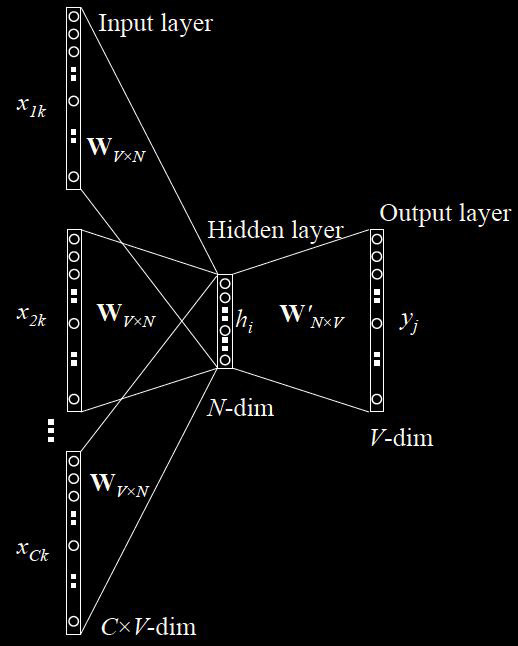
    - Skip-Gram 和 CBOW 相反，是根据某一个词来预测它的前 C 个词和后 C 个词。同样训练两个矩阵 $W$ 和 $W'$，其中，$W$ 矩阵是 lookup table。一般来说，Skip-Gram 的训练时间比 CBOW 要慢。
        
    
    为了加快训练速度，word2vec 采用了两种优化方式。
    - Hierarchical Softmax，用霍夫曼树代替神经网络，本质上是将 n 分类变成 log(n) 次二分类。
    - Negative Sampling，由于霍夫曼树中高频词离根结点较近，但是如果中心词是较生僻的词，那么就要消耗很长时间。简要来说就是从负样本中选取一部分来更新，而不是更新全部的权重。

3. GloVe 模型

    GloVe 模型利用了词语的共现频率来计算相关性。首先引入词语的共现矩阵 $X$，其中 $X_{ij}$ 是在 word i 的上下文中 word j 的出现次数，$X_i = \sum_k X_{ik}$ 是出现在 word i 的上下文中所有词的出现次数，则共现概率为 $P_ij = P(j|i) = \frac{X_{ij}}{X_i}$，是word j 出现在 word i 上下文的概率。可以发现，共现概率的比例可以反映两个词的**相关度**。

### HMM / CRF

1. 隐马尔可夫模型 Hidden Markov Model, HMM

    - 马尔可夫链，即一个状态序列，满足在任意时刻 $t$ 的状态仅与其前一时刻的状态有关。隐马尔可夫链，则是无法直接观测到某一时刻的状态，而是要通过其他的观测状态才能预测隐藏的状态。
    - 隐马尔可夫模型的两个基本假设：
      - **齐次性假设**：即隐藏的马尔可夫状态在任意时刻的状态只依赖于前一时刻的状态，与其他时刻的状态无关；
      - **观测独立性假设**：任意时刻的观测状态只取决与当前状态的隐藏状态，和其他时刻的观测状态或隐藏状态无关。
    - 隐马尔可夫模型的五个要素：
      - **隐藏状态集** $Q$ = {$q_1$, $q_2$, ..., $q_N$}，即隐藏节点只能取值于该集合中的元素。
      - **观测状态集** $V$ = {$v_1$, $v_2$, ..., $v_M$}，即观测节点的状态也只能取值于该集合中的元素。
      - **隐藏状态转移矩阵** $A$ = $[a_{ij}]_{N\times N}$，表示从一种隐藏状态到另一种隐藏状态的转移概率。
      - **观测概率矩阵** $B$ = $[b_{ij}]_{N\times M}$，表示对于某一种隐藏状态，其观测状态的分布概率。
      - **初始隐藏状态概率** $\pi$ = $[p_1, p_2, ..., p_n]$，表示初始时刻处于各个隐藏状态的概率。
    - 隐马尔可夫模型要求解的基本问题：
      - **概率计算问题**。对于已知模型 $\lambda$ = $(A, B, \pi)$，和已知观测序列 $O$ = {$o_1$, $o_2$, ..., $o_M$}，求产生这种观测序列的概率是多少，即求 $p(O|\lambda)$。
      - **学习问题**。对于已知观测序列 $O$ = {$o_1$, $o_2$, ..., $o_M$}，求解模型 $\lambda$ = $(A, B, \pi)$ 的参数，使得产生这种观测序列的概率 $p(O|\lambda)$ 最大，即用**最大似然估计**方法估计模型的参数。
      - **解码问题**。同样对于已知模型 $\lambda$ = $(A, B, \pi)$，和已知观测序列 $O$ = {$o_1$, $o_2$, ..., $o_M$}，求解最优的隐藏状态序列 $I$ = {$i_1$, $i_2$, ..., $i_N$}，使得 $p(I|O)$ 最大。
    - 对于基本问题的解法：
      - 对第一个问题的解法：
        - 暴力解法：时间复杂度为 $O(TN^T)$；
        - 前向算法：利用动态规划思想，将前面时刻计算过的概率保存下来。
          - 对于第一个时刻的状态：$a_1(i) = \pi_ib_i(o_1)$, $i\in [1,N]$；
          - 对于第 $t$ 个时刻的状态：$a_t(i) = [\sum_{j=1}^N a_{t-1}(j)a_{ji}]b_i(o_t)$。
      - 对第二个问题的解法：
        
        Baum-Welch 算法：与 EM 算法相似，在 E-step 中，计算联合分布 $P(O,I|\lambda)$ 和条件分布 $P(I|O,\bar{\lambda})$，根据联合分布和条件分布计算期望表达式 $L(\lambda,\bar{\lambda})$；在 M-step 中最大化 $\lambda$ 的值，使得 $\bar{\lambda} = \argmax_\lambda L(\lambda,\bar{\lambda})$。
    
      - 对第三个问题的解法：

        Viterbi 维特比算法：可以看作一个求最长路径的动态规划算法。

        初始化两个状态变量：$\delta_t(i)$ 表示在 $t$ 时刻隐藏状态为 $i$ 的所有状态转移路径中概率最大值，初始化 $\delta_1(i) = \pi_i b_i(o_1)$。$\psi_t(i)$ 则是在 $t$ 时刻使得隐藏状态为 $i$ 的转移路径中概率最大的前一时刻的隐藏状态，初始化为 0。则两状态变量的递推表达式为：

        $$
            \begin{cases}
                \delta_t(i) = \max_{1\leq j\leq N}[\delta_{t-1}(j)a_{ji}]b_i(o_t) \\
                \psi_t(i) = \argmax_{1\leq j\leq N}[\delta_{t-1}(j)a_{ji}]
            \end{cases}
        $$

        在第 $T$ 步，取 $\delta_T(i)$ 最大值即为最可能隐藏序列出现的概率，此时最大的 $\psi_T(i)$ 即为第 $T$ 的状态。

        随后，从第 $T$ 步开始回溯，即 $i^*_{t-1}$ = $\psi_t(i^*_t)$，得到完整的隐藏序列 $I=(i^*_1, i^*_2, ..., i^*_T)$。

2. 条件随机场 Conditional Random Field, CRF

    首先介绍随机场。一组随机变量，分布在同一个样本空间，那么它们就组成了一个随机场。我们希望利用这些随机变量之间的关系来解决实际问题。

    马尔可夫随机场是满足马尔可夫独立性的随机场，即每个节点仅与其相邻的节点有关系。并不像贝叶斯网络（有向无环图）一样，通过变量之间的条件分布建模（节点与节点之间的依赖关系），马尔可夫随机场是根据变量之间的联合分布来建模的。当知道了变量之间的联合分布，则它们之间的条件分布也就能求解出来。因此，马尔可夫随机场是**生成模型**。

    条件随机场则是对条件概率建模。即已经观测到部分点的前提下，求解整张图的分布。

    HMM 是通过对可观测序列和隐藏序列的联合概率建模，估计模型的隐含变量的分布，再计算概率最大的隐藏序列，是一个**生成模型**。CRF 则是直接对条件概率 $P(I|O)$ 建模，通过可观测序列直接判别出隐藏序列，是一个**判别模型**。

    比较常见的条件随机场是线性链条件随机场。设 $X = (X_1, X_2, ..., X_n)$, $Y = (Y_1, Y_2, ..., Y_n)$ 均为线性链表示的随机变量序列。在给定 $X$ 的情况下，随机变量序列 $Y$ 的条件概率分布构成线性链条件随机场，即 $Y$ 的分布只与其相邻的节点有关。

    与 HMM 相似，条件随机场主要求解的也是三个问题：
     - 概率计算问题：给定条件随机场 $P(Y|X)$, 观测序列 $x$ 和隐藏序列 $y$，计算条件概率 $P(Y_i=y_i|x)$，可以通过前向后向解法求解
     - 学习问题：已知观测序列和隐藏序列，通过极大似然估计法来学习模型的最大概率参数。
     - 预测问题：给定条件随机场 $Y=(Y|X)$ 和观测序列 $x$，求条件概率最大的隐藏序列 $y^*$，即**对观测序列进行标注**。预测问题的常用算法是维特比算法。

    CRF 是一个序列化标注算法，接收一个输入序列 $X = (x_1, x_2, ..., x_n)$，输出目标序列 $Y = (y_1, y_2, ..., y_n)$，可以被看作是一个 Seq2Seq 模型。在词性标注任务中，输入为文本序列，输出则为对应的词性序列。

    相比于 HMM 需要对状态转移矩阵和观测概率矩阵建模，CRF 属于判别模型，其直接对 $P(I|O)$ 建模：

    $$ 
        P(I|O) = \frac{1}{Z(O)}e^{\sum_i^T \sum_k^M \lambda_k f_k(O, I_{i-1}, I_i, i)}
    $$

    其中，下标 i 表示当前所在的节点（token）位置，下标 k 表示第 k 个特征函数，并且每个特征函数都附属一个权重 $\lambda_k$，$\frac{1}{Z(O)}$ 是归一化系数。

### RNN / LSTM

1. 为什么需要 RNN？

    循环神经网络（Recurrent Neural Network, RNN）。当给定的数据是序列型数据，如文本、音频等数据时，我们往往希望模型能够学习到给定数据的上下文环境。例如，对于一个句子，序列模型试图从同一个句子前面的单词推导出关系。

    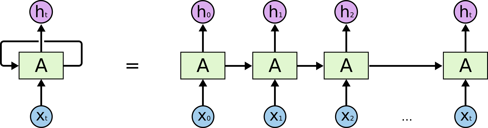

    在循环神经网络的每一个时间步骤（time step）中，我们取一个输入 $x_i$ 和上一个节点的权值 $h_{i-1}$ 作为输入，并产生一个输出 $y_i$ 和权值 $h_i$，这个权值又被传递到下一个时间步骤，直到输入序列被读取完毕。

    

    普通的 RNN（Vanilla RNN）常使用 BP 算法来训练权值，但由于**梯度消失 / 梯度爆炸**问题，RNN 会丧失学习远距离信息的能力。为了解决远距离依赖问题，提出了 LSTM（Long Short-Term Memory）。

2. LSTM 网络

    LSTM（Long Short-Term Memory）相对于普通 RNN 网络，能够显著的缓解长期依赖关系丢失的问题。LSTM 的主要思想是利用**门结构**来去除或添加单元之间信息传递的能力。LSTM 拥有三个门，来保护和控制单元状态，分别为**遗忘门**、**输入门**和**输出门**。

    - 遗忘门

        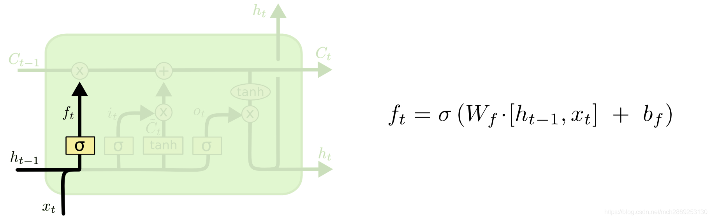
        第一步是决定从上一个单元中保留多少消息。将上一单元的状态 $h_{t-1}$ 和这一层的输入 $x_i$ 经过 sigmoid 层，输出一个 0-1 的值，代表要从上一层的单元状态保留多少信息。

    - 输入门

        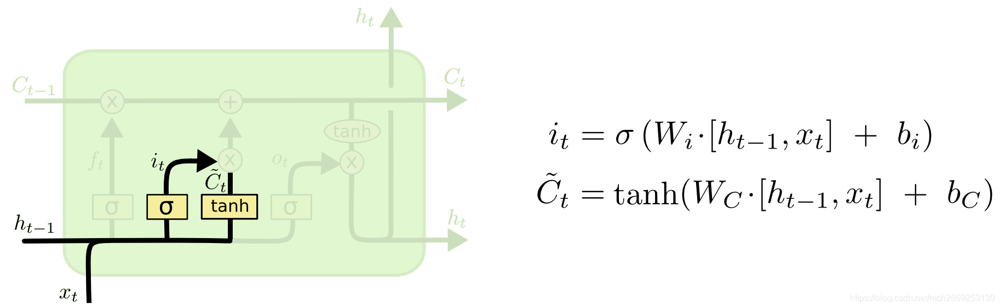
        这一步是决定在这一层的单元状态中保留多少信息。将上一单元的状态 $h_{t-1}$ 和这一层的输入 $x_i$ 分别经过 sigmoid 层和 tanh 层，得到一个候选的单元状态 $\tilde{C}_t$。

        
        随后，根据遗忘门得到的遗忘比例 $f_t$ 和这一层要输入的单元状态 $\tilde{C}_t$，得到这一层的最终单元状态 $C_t = f_t*C_{t-1} + i_t*\tilde{C}_t$。

    - 输出门

        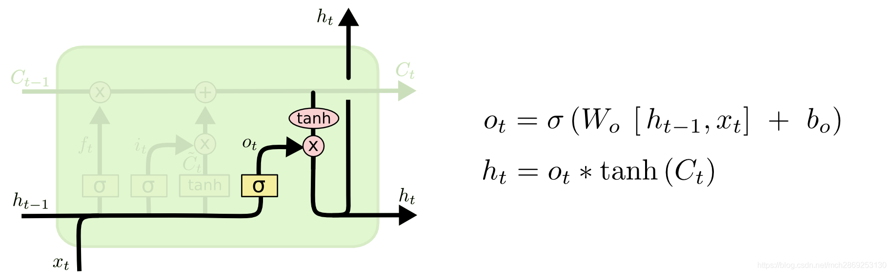
        最终，我们需要决定这一层的单元的输出状态。将上一单元的状态 $h_{t-1}$ 和这一层的输入 $x_i$ 经过 sigmoid 层，确定要输出的部分 $o_t$，再将这一层的单元状态 $C_t$ 经过 tanh 层，再与 $o_t$ 结合，得到最终的输出状态 $h_t$。

3. GRU 网络

    与 LSTM 对比，GRU 网络更加简单，训练更加高效。GRU 去除了单元状态，将 LSTM 的 3 个门减少到 2 个，分别为更新门和重置门，分别决定了应该让多少信息通过单元，以及应该丢弃多少信息。

    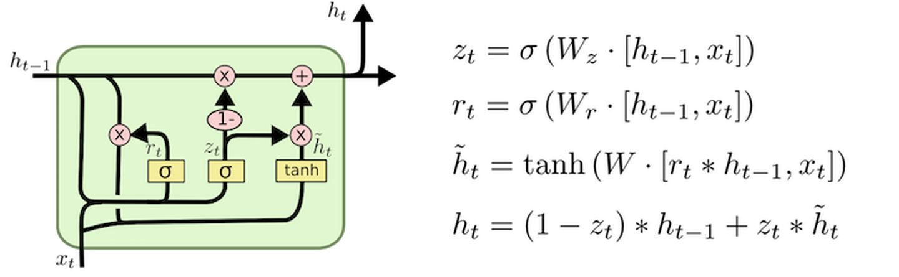

4. 如何计算 LSTM 和 GRU 的参数量？

    一个单元内一共有四个非线性门 ($W[h_{t-1},x_t] + b$)，每一个门内的可训练变量包括一个矩阵 $W$ 和一个置项 $b$。

    因此，一个 LSTM 非线性门的参数即为 **(embed_size + hidden_size) * hidden_size +hidden_size**，LSTM 四个门的总参数量为 **((embed_size + hidden_size) * hidden_size +hidden_size) * 4**。

    同理，一个 GRU 单元的参数量为 **((embed_size + hidden_size) * hidden_size + hidden_size) * 3**。

4. RNN / LSTM 的局限性
   
   - 对于 RNN 来说，在访问一个单元前需要遍历之前所有的单元，使得在长文本下极度容易出现梯度消失问题。
   - LSTM 利用门机制稍微缓解了 RNN 的梯度消失问题，但在超长文本前仍然存在该问题。
   - 在 LSTM 中，在每一个单元中都有 4 个 MLP 层，需要消耗大量的计算资源，且模型本身不利于并行化。

### TextCNN

1. 如何卷积？

    输入一个长度为 $s$ 的句子，将其分词后映射到词向量，假设词向量的维度为 $d$，那么该句子可以表示为一个 $s\times d$ 的矩阵。将该矩阵看作一张图像，用卷积神经网络提取特征。

    **文本卷积和图像卷积的区别在与文本序列只在垂直方向做卷积**，即卷积核的宽度固定为词向量的维度 $d$。 

2. TextCNN 的优缺点？

    - 优点：网络结构简单，训练速度快，适合进行并行化，对短文本效果好；使用 Max-Pooling，便于提取最关键信息，因此适用于文本分类等任务。
    - 缺点：全局 Max-Pooling 丢失了结构信息，很难发现文本中的依赖关系；只能学习到关键词是什么，无法学习到关键词的频率和顺序。

### Attention Mechanism / Transformer

1. Seq2Seq 中的 Attention 机制

    在 Seq2Seq 中，我们使用 encoder 将输入文本转化为一个定长向量，再用 decoder 将该向量转换为输出文本。但是，在面对长文本时，我们很难在定长向量中保留完整的输入文本信息，因此在 decode 时会存在信息丢失的问题。为了缓解这个问题，我们引入了 Attention 机制。

    以机器翻译任务举例，在翻译到某一个单词时，我们希望能够注意到这个单词所对应的上下文，并结合之前已翻译的部分作出相应的翻译。这样，我们在 decoder 中就可以注意到输入文本的全部信息，而不只局限于那个定长的向量。

    Attention 的计算过程如下：

    - 得到 encoder 中的 hidden state $\overrightarrow{h_e} = (h_1, h_2, ..., h_n)$。
    - 假设当前翻译到的 decoder state 为 $\overrightarrow{s_{t-1}}$，则可以计算该状态与输入的每一个单元 $h_j$ 状态的关联性 $e_{tj} = a(s_{t-1},h_j)$，写成向量形式则为 $\overrightarrow{e_t} = a(\overrightarrow{s_{t-1}}, \overrightarrow{h})$，其中，$a$ 是相关性的计算，常见的计算方式有：
      - 直接点乘 $a(s_{t-1},h_j)=\overrightarrow{s_{t-1}}^T\cdot\overrightarrow{h}$；
      - 加权点乘 $a(s_{t-1},h_j)=\overrightarrow{s_{t-1}}^T\cdot W \cdot\overrightarrow{h}$，其中，$W$ 是可训练矩阵；
      - 多层感知机 $a(s_{t-1},h_j)=V \cdot \tanh(W_1 \cdot \overrightarrow{s_{t-1}} + W_2 \cdot \overrightarrow{h})$，其中，$V$、$W_1$、$W_2$ 都是可训练矩阵；
      - 缩放的点乘 $a(s_{t-1},h_j)=\frac{\overrightarrow{s_{t-1}}^T\cdot\overrightarrow{h}}{\sqrt{|\overrightarrow{h}|}}$。Softmax 函数对非常大的输入很敏感。这会使得梯度的传播出现问题，并且会导致学习的速度下降，甚至会导致学习的停止。那如果我们使用 $\sqrt{|\overrightarrow{h}|}$ 来对输入的向量做缩放，就能够防止进入到 softmax 函数的饱和区，使梯度过小。
    - 对 $\overrightarrow{e_t}$ 进行 softmax 操作后得到 Attention 分布 $\overrightarrow{\alpha_t} = softmax(\overrightarrow{e_t})$，其中，$\alpha_{tj} = \frac{\exp(e_{tj})}{\sum_{i=1}^n \exp(e_{ti})}$。
    - 计算得到**上下文表示** $\overrightarrow{c_t}=\sum_{j=1}^n \alpha_{tj}\cdot h_j$。
    - 我们可以将该上下文表示利用到下一个时间步的状态生成 $s_t = f(s_{t-1}, y_{t-1}, c_t)$。

2. Q(Query), K(Key), V(Value)

    在 Attention 中，Q(Query) 指的是被查询的向量，即根据什么来关注其他的单词；K(Key) 指的是查询的向量，即被关注的向量的关键词；V(Value) 则是的被关注的信息本身。

    使用 Q 和 K 计算了相似度之后得到相似度评分，之后有了相似度评分，就可以把内容 V 加权回去了。

3. Transformer

    既然我们知道 Attention 机制本身就可以获取上下文信息，那么我们可不可以将原本的 RNN 结构完全去掉，仅仅依赖于 Attention 模型呢？这样我们可以使得训练并行化，并且可以拥有全局的信息。根据这个思想，产生了 Transformer 模型。其模型结构如下：

    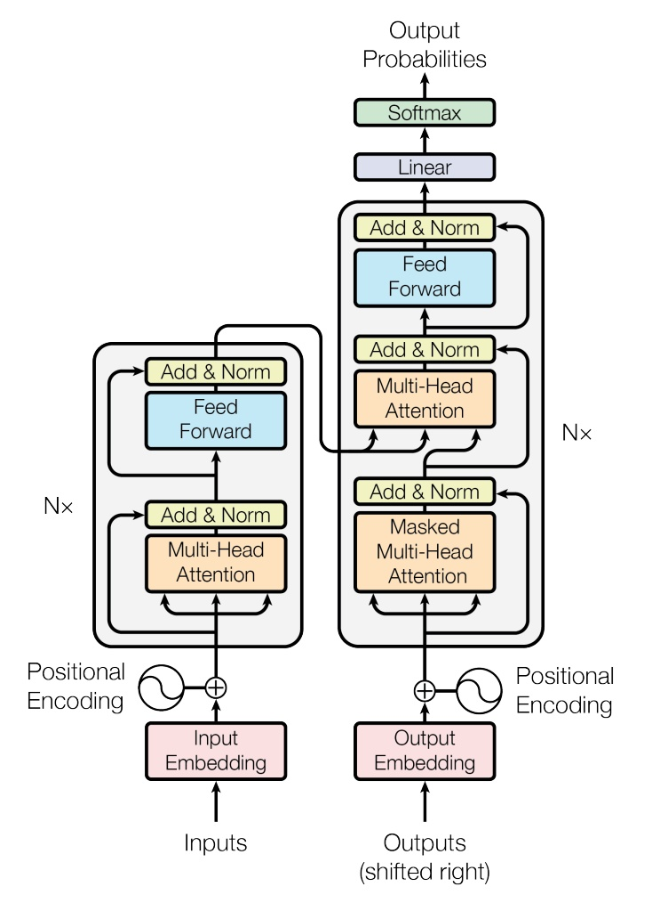

    - Self-Attention 机制
    
        Seq2Seq 中的 Attention 机制是在 decode 过程中，逐步计算对应的上下文表示，仿照这个思想，Self-Attention 就是在 encode 阶段，便考虑到每个输入单词与其他单词的关联性，从而得到具有上下文信息的 input embedding 信息。因此，对于 Self-Attention，其 Q, K, V 都来自于同一个输入矩阵，即 Q=K=V。

        Self-Attention 的计算过程如下：
      - 输入序列 $\overrightarrow{x}$；
      - 将 $\overrightarrow{x}$ 分别与对应 Q, K, V 的三个可训练矩阵 $W_q$, $W_k$, $W_v$ 点乘，得到 $Q=\overrightarrow{x}\cdot W_q$, $K=\overrightarrow{x}\cdot W_k$, $V=\overrightarrow{x}\cdot W_v$；
      - 计算 $Attention(Q,K,V)=softmax(\frac{Q\cdot K^T}{\sqrt{d_K}})\cdot V$，其中，$d_K$ 为 $K$ 的维度。

    - Multi-Head Attention

        为了使模型能够从不同角度获取输入序列的上下文信息，同时引入多组 ($W_{qi}$, $W_{ki}$, $W_{vi}$) 矩阵，分别得到多个 ($Q_i$, $K_i$, $V_i$)，再将它们**按列拼接**，之后经过一个联合矩阵 $W_o$，得到最终的 Attention 表示。过程如图所示：

        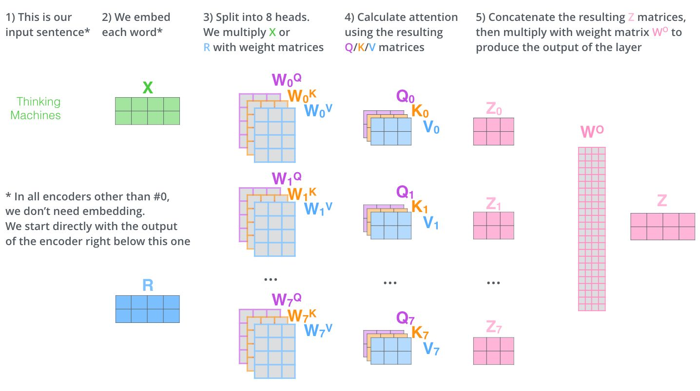

        注意，在 Transformer 的模型中，有多个 Multi-Head Attention 步骤。其中，encoder 中的 Attention 和 decoder 中的第一步 Attention 的步骤都仅以前一级的输出作为输入，而在 decoder 中的第二步 Attention 则不仅接受来自前一级的输出，还要接收 encoder 的输出。

        即，在第一种 Multi-Head Attention 中，有 $Q = K = V$，在第二种 Multi-Head Attention 中，则 $Q \neq K = V$。

    - Positional Encoding

        由于 Transformer 模型没有循环结构或卷积结构，为了使模型能够学习到输入序列的顺序，我们需要插入一些关于 tokens 位置的信息。因此提出了 **Positional Encoding** 的概念，其与 input embedding 具有相同的维度，便于相加。

        但是，如果直接使用计数的方式来进行 encoding，即 $pos = 1, 2, ..., n - 1$，那么最后一个 token 的encoding 将会比第一个 token 大很多，与原 embedding 相加后会造成数据不平衡的现象。原论文作者们的方法是使用了不同频率的正弦和余弦函数来作为位置编码：
        $$
            \begin{aligned}
                PE_{(pos,2i)}   & = sin(pos/10000^{2i/d_{model}}) \\
                PE_{(pos,2i+1)} & = cos(pos/10000^{2i/d_{model}}) \\
            \end{aligned}
        $$
    
    - Add & Norm 层
      - Add 指的是 Residual Connection，与 ResNet 的原理相似，是将上一层的信息直接传到下一层，可以帮助解决多层神经网络训练困难的问题。
      - Norm 指的是 Layer Normalization，在层与层之间对每一行数据进行缩放。这样可以缓解梯度消失的状况，同时使模型更快收敛。
        > **Batch Normalization 和 Layer Normalization 的区别？**
        > 
        > 在 BN 中，我们将每一个 batch 中的数据**按列**进行缩放。而在 NLP 任务中，由于输入序列的长度是不确定的，且不同行同一位置的单词直接并没有直接联系，直接做缩放可能会影响原语义表达。因此，在 NLP 等序列型任务中，我们一般采用 Layer Normalization，即对每一行数据进行缩放。
    

4. BERT: Bi-directional Encoder Representation from Transformers

    - 双向表示

        区别于 Bi-LSTM 的双向表示，分别正序和反序得到表示再进行拼接，BERT 中的双向指的是根据前文和后文来预测被 masked 的单词。

    - Embedding

        BERT 中的 embedding 由三个部分组成：Token Embedding，Segment Embedding，Position Embedding。
        - Token Embedding 是词向量，其中，第一个词为 [CLS] 标记，可以用于之后的下游任务。
        - Segment Embedding 用于区分 BERT 输入的两个句子，之后的 pre-training 将会用到。
        - Position Embedding 由学习得到，而不是普通 Transformer 中的三角函数。

    - Pre-training Tasks
        - Masked LM
            
            在训练过程中，将 15% 的单词用 [mask] 代替，让模型去预测被遮挡的单词，最终的损失函数只计算被遮盖的 token。

            但是如果一直用 [mask] 表示（实际预测时并不会遇到 [mask] 标记）会影响模型，因此作者设置了一下规则：80% 的时间用 [mask] 来代替被遮盖的单词，10% 的时间随机用另一个单词代替，剩下 10% 的时间保留原单词。

            值得注意的是，模型并不知道哪些单词被遮盖了，这使得模型能够关注到每一个单词，依赖上下文信息预测单词，赋予了模型一定的纠错能力。
        
        - Next Sentence Prediction

            对于输入的两个句子 A 和 B，让模型预测 B 是否应该是 A 的后一句。该任务的目的是让模型理解两个句子直接的关系。
    
    - 为什么BERT在第一句前会加一个 [CLS] 标志?

        为了获得整个句子的语义表示，用于其他任务。一个没有明显语义的 [CLS] 标记会更加**公平**地融合句子中每个单词的语义，从而获得更加完整的句子表示。

    - BERT 的优缺点？

        优点是建立在 Transformer 上，相对rnn更加高效，具有强大的信息提取能力，能捕捉更长距离的依赖。且双向模型比单向的 Transformer 效果更好；
        
        缺点则是该模型几乎无法修改，只能拿来直接用。由于只能预测 15% 的词，模型收敛较慢，需要强大算力支撑。

    - 使用BERT预训练模型为什么最多只能输入 512 个词，最多只能两个句子合成一句？

        这是由于在预训练的时候，在参数中设置了 position embedding 的大小和 segment embedding 的大小，分别为 512 和 2。在这之外的单词和句子会没有与之对应的 embedding。

    - BERT 的输入和输出分别是什么？

        输入是 token embedding，segment embedding 和 position embedding，输出是文本中各个字 / 词融合了全文语义信息后的向量表示。

    - 计算 BERT 模型的参数数量？
        - 词向量参数：vocab_size=30522, hidden_size=768, max_position_embedding=512, token_type_embedding=2，因此参数量为 (30522 + 512 + 2) * 768。
        - Multi-head Attention：len = hidden_size = 768, $d_k$ = $d_q$ = $d_v$ = $d_{model}/n_{head}$ = 768 / 12 = 64，将12个头进行拼接后还要进行线性变换，因此参数量为 768 * 64 * 12 * 3 + 768 * 768。
        - 前馈网络参数：$\text{FFN}(x)=\max(0, xW_1+b_1)W_2 + b_2$，W_1 和 W_2 的参数量均为 768 * (768 * 4)，总参数量为 768 * 768 * 4 * 2。

        总参数量 = 词向量参数 + 12 (层数) * (Multi-head + 前馈网络) = 110M

5. ALBERT

    - Factorized Embedding Parameterization

        在 BERT 中，模型直接将词表对应到 word embedding 中，embedding 的维度大小和隐藏层 H 的维度大小相等。这是没有必要的，因为当维度大小 $d_H$ 增加时，word embedding 维度的增加没有意义。因此引入多一层转换矩阵 E，让词表 V 先通过转换矩阵，再转换为隐藏层的维度大小。这样可以明显减小参数量，由之前的 $(d_V * d_H)$ 减少为 $(d_V * d_E + d_E * d_H)$。
    
    - Cross-Layer Parameter Sharing

        BERT 框架中的参数主要包括 Attention 层的参数和 Feed Forward 网络的参数，ALBERT 将这些参数都共享，大大减小了参数量，为了弥补性能的损失，ALBERT 加大了隐藏层的维度大小，由“窄而深”变成“宽而浅”。

    - Sentence Order Prediction 

        针对 BERT 的第二个训练任务，即判断 A 是否是 B 的下一句话，过于简单的问题，ALBERT 增加了预训练的难度，即将负样本换成了两个句子的逆序排列。

        > **[NSP 任务]** 正样本：同一个文档的两个连续句子；负样本：两个连续句子交换顺序
        > 
        > **[SOP 任务]** 正样本：同一个文档的两个连续句子；负样本：不同文档的句子

6. XLNet

    由于 BERT 在预训练过程中需要加入 [mask]，而在下游任务及预测过程中都没有这样的标记，因此会造成性能损失。XLNet 则通过自回归语言模型的思想来解决，即从左到右依次生成。为了保持模型仍然是双向的，能够同时从前文和后文获取信息，XLNet 引入了 Attention Mask 机制。

    假设模型在预训练过程中需要预测第 $k$ 个词，那么首先先将序列随机打乱，再取前 $k-1$ 个词进行预测，这样既可以读到前后文的信息，又可以省去 [mask] 标记。

    这样的预训练模式天然符合下游任务序列生成的任务，因此可以预计 XLNet 在文本摘要，机器翻译，信息检索等领域具有优势。

7. TinyBERT

    由于 BERT 模型过于庞大，很难实际应用落地。因此提出了一种蒸馏 BERT 的方法 TinyBERT，它的大小不到 BERT 的 1/7，但速度提高了 9 倍。

    知识蒸馏的基本思想是使用一个大的训练好的模型来知道小模型更好的训练。TinyBERT 的基本思想是减少 Transformer 的层数以及降低 hidden_size 的大小。模型结构如下：

    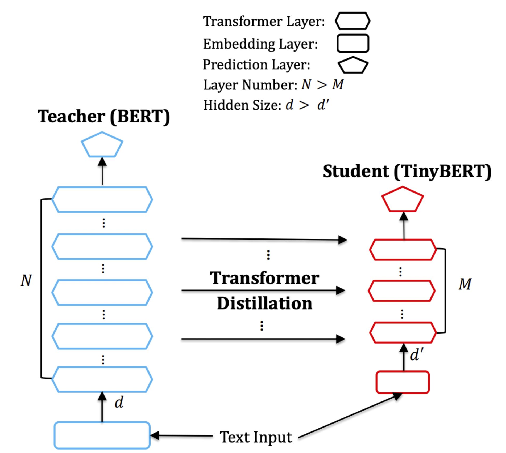

    TinyBERT 的 loss 分为三部分：

    - Embedding Layer Distillation

        TinyBERT 的 embedding 大小比教师模型更小，因此需要通过一个维度变换矩阵来把学生模型的 embedding 映射到教师模型所在空间，再通过 MSE 来计算 loss：
        $$
            \mathcal{L}_{embd}= \text{MSE}(E^SW_e, E^T)
        $$

    - Transformer Layer Distillation

        TinyBERT 的知识蒸馏采取每隔 k 层蒸馏的方式。设 Teacher BERT 有 12 层，TinyBERT 有 4 层，则学生模型每隔 3 层就与教师模型计算一次 loss，其中，loss 又分为 Attention Loss 和 Hidden Loss：

        $$
            \mathcal{L}_{attn} = \frac{1}{h}\sum_{i=1}^h \text{MSE}(A_i^S, A_i^T)
        $$
        其中，h 为 Attention 头数，$A_i\in \{A_q,A_k,A_v\}$。

        $$
            \mathcal{L}_{hidn} = \text{MSE}(H^SW_h, H^T)
        $$

    - Prediction Layer Distillation

        在预测层的 loss 计算取决于不同的具体任务，但都需要结合教师模型和学生模型的 loss。

8. RoBERTa

    - 去除 NSP 任务
    - 动态掩码。RoBERTa的做法是将训练数据复制多份，每份采用不同的随机挑选 token 进行掩码。这样有助于模型适应不同的掩码策略，学习不同的语言表征。
    - 文本编码。使用了更大的词汇表来训练。

